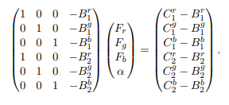
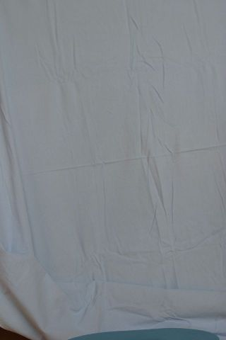
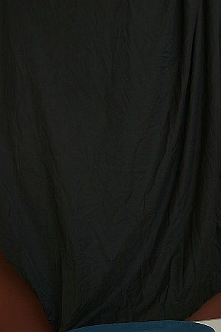
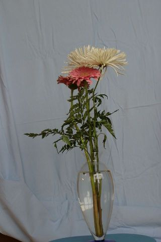
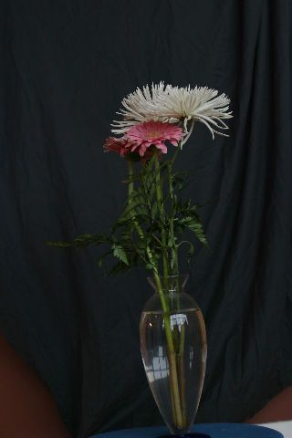
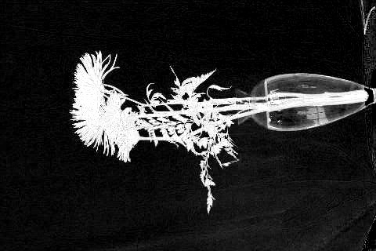

### Blue Screen Matting by Smith & Blinn

For those interested, paper is in the repo along with the necessary files to build the VS Solution.

Instructions: 4 images are needed, two with the object in the image, each with a different background, and one of each background. It is important that the camera, object and the background are completely still in between shots. Press ESC to exit the program.

#### Requirements:

* OpenCV 3.4.9 [Link](https://opencv.org/releases/)
* Eigen [Link](https://eigen.tuxfamily.org/dox/)
    

#### Solution

 

Solve the linear least squares problem for each pixel.  

```
X = A.colPivHouseholderQr().solve(b);
```

#### Results

 
 
 
 
 


 
